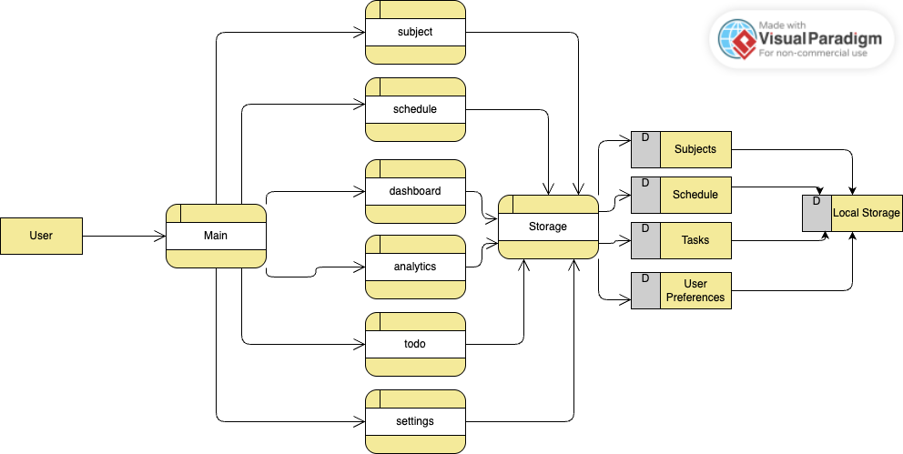

# Student Study Planner

A frontend-only student productivity web application built using HTML, CSS, and vanilla JavaScript.
The app helps students organize subjects, schedules, tasks, and track academic progress, with all data securely stored in the browser using localStorage—no backend required.

The application is implemented as a Progressive Web App (PWA) using a Service Worker, enabling offline access, faster load times through caching, and installability on supported devices.

<h2 align="center"><a href="https://luminous-profiterole-d4e59b.netlify.app/">Get Started </a></h3>

---

 </img>

---

## Table of Contents

- [Features](#features)
  - [Dashboard](#dashboard)
  - [Subjects](#subjects)
  - [Schedule Planner](#schedule-planner)
  - [Task Manager](#task-manager)
  - [Progress Analytics](#progress-analytics)
  - [Settings](#settings)
- [Project Structure](#project-structure)
- [Data Persistence](#data-persistence)
- [Getting Started](#getting-started)
- [Design Philosophy](#design-philosophy)

---

## Features

### Dashboard
- Displays total subjects and pending tasks
- Shows:
  - Subjects list
  - Today’s schedule
  - Recent tasks 
- Scrollable cards for clean UI

---

### Subjects
- Add subjects with priority:
  - Low
  - Medium
  - High
- Subjects stored in localStorage
- Used in schedule planning and analytics
- Priority-based insights

---

### Schedule Planner
- Add schedules by:
  - Day
  - Time range
  - Type (Subject or Activity)
- Subject schedules link to existing subjects
- Weekly timetable displayed in table format
- Weekly stats showing number of scheduled items

---

### Task Manager
- Todo-style task management
- Task types:
  - Assignment
  - Exam
  - Deadline
  - Misc
- Filter tasks by type
- Tracks completed and pending tasks
- Dashboard displays latest 10 pending tasks

---

### Progress Analytics
- Implemented using pure CSS (no chart libraries)
- Subject priority distribution (High / Medium / Low)
- Task completion analysis (Completed vs Pending)

---

### Settings
- Theme system inspired by VS Code:
  - Light+
  - Dark+
  - One Dark Pro
  - Dracula
  - GitHub Dark
- Live localStorage usage indicator
- Export all data as JSON
- Reset all stored data

---

## Project Structure

 </img>

---

## Data Persistence

All application data is stored locally using `localStorage`:
- Subjects
- Schedules
- Tasks
- Theme preferences

No backend or external APIs are used.

---

## Getting Started

Heres the deployed link - <a href="https://luminous-profiterole-d4e59b.netlify.app/">Student Study Planner </a>

1. Start using it or download it to use offline

OR

1. Clone or download the repository
2. Open `index.html` in a modern browser
3. Start adding subjects, schedules, and tasks

No installation or build process required.

---

## Design Philosophy

- Minimal, distraction-free UI
- Modular and readable JavaScript
- No frameworks to keep the project simple
- Easy to extend with backend or libraries later

